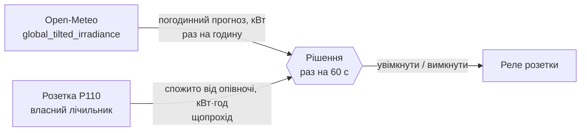
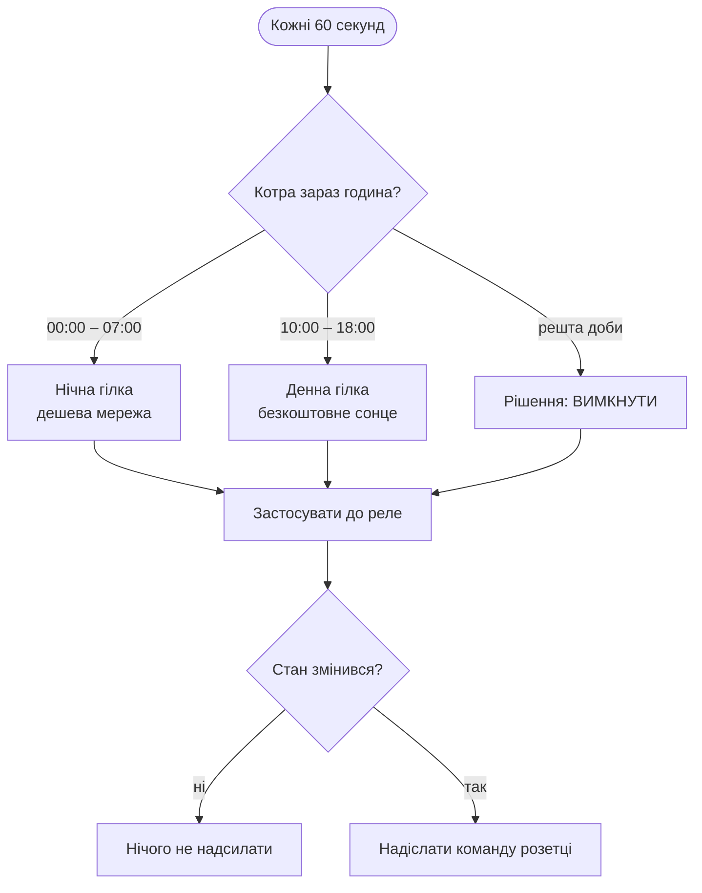
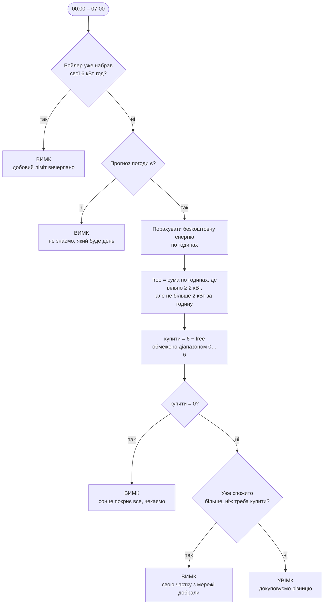
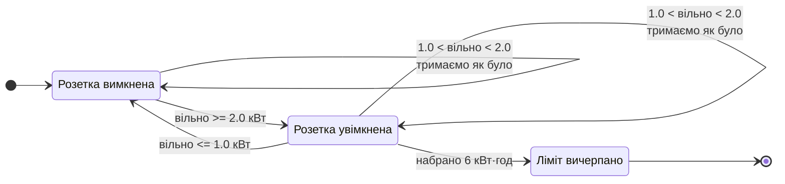
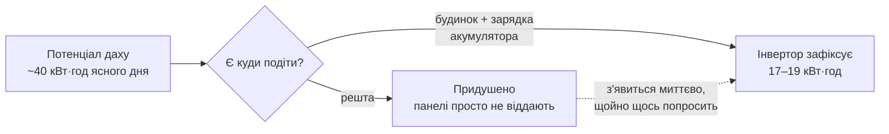
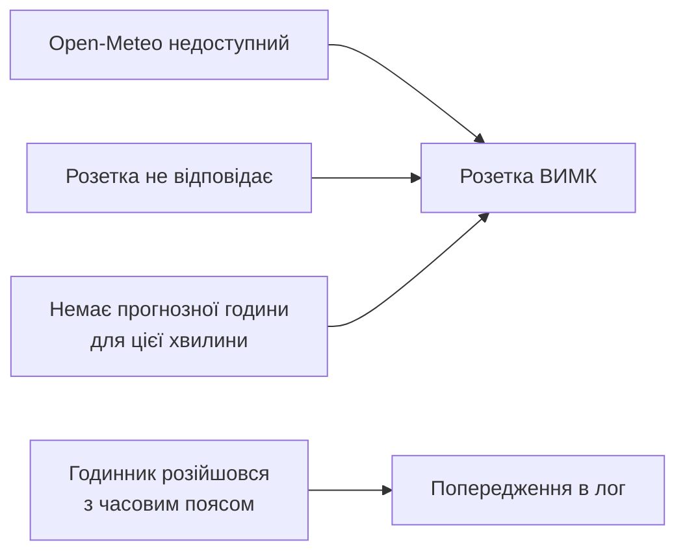

# Як працює алгоритм

Бойлеру треба **6 кВт·год на добу**. Програма щоночі рахує, скільки з них
завтра дасть сонце безкоштовно, і докуповує з мережі **тільки різницю**.

Керується **одна розетка** — `PLUG_B_IP`. Більше нічого програма не чіпає.

---

## 1. Звідки беруться числа

Два джерела — і більше жодного. Інвертор не опитується взагалі.



Прогноз рахується під **вашу геометрію панелей** — 10 кВт, нахил 20°,
азимут 240°. Open-Meteo одразу віддає освітленість у площині панелі, тому
ніякої тригонометрії в коді немає.

Лічильник розетки обнуляється опівночі — рівно тоді, коли починається нічне
вікно. Тому він показує саме те, що програма влила в бойлер за цю добу.

### Ключове число: «вільний дах»

Обидві гілки стоять на одній величині, порахованій для кожної години:

```
вільно(година) = прогноз кВт цієї години − HOUSE_BASELINE_KW

HOUSE_BASELINE_KW = HOUSE_DAYTIME_KWH / довжина вікна SOLAR_START–SOLAR_END
```

8 кВт·год будинку на вікні 10:00–18:00 — це 1.0 кВт, який дах віддає будинку
перш ніж бойлер побачить бодай щось. Година на 3 кВт має 2 кВт вільних;
година на 0.4 кВт не має нічого і йде в мінус.

---

## 2. Загальний цикл



Якщо стан не змінився — команда не надсилається взагалі. Тиха ніч це один
`OFF` на старті й більше нічого.

**Обидва вікна ділять один добовий ліміт у 6 кВт·год.** Якщо вночі бойлер узяв
2 кВт·год, удень він добере лише 4.

---

## 3. Нічна гілка (00:00 – 07:00)



### Формула

```
free   = сума по годинах вікна 10:00–18:00:
           min(DEVICE_POWER_KW, вільно(година))
         враховуються лише години, де вільно ≥ SOLAR_SURPLUS_ON_KW

купити = 6 − free,  але не менше 0 і не більше 6
```

Розетка вимикається **посеред вікна**, щойно лічильник показав потрібну
частку. Не «всі 6 або нічого».

> **Чому по годинах, а не одним добовим числом.** Розмазаний день, що видає
> 12 кВт·год по 1.5 кВт, не перетинає поріг **жодного разу** — бойлеру не
> дістається нічого. Ті самі 12 кВт·год гострою дугою покривають його двічі.
> Добовий підсумок ці два дні не розрізняє, і ніч купувала б хибну кількість
> в обох випадках. Заразом це тримає вікна чесними одне щодо одного: вночі
> програма передбачає рівно те, що вдень і зробить, по тій самій кривій.

---

## 4. Денна гілка (10:00 – 18:00)

Тут працює гістерезис — два пороги замість одного.



| Вільно цієї години | Розетка |
|---|---|
| **≥ `SOLAR_SURPLUS_ON_KW` (2.0)** | **УВІМК** — дах тягне бойлера сам, це безкоштовно |
| 1.0 – 2.0 | тримається в тому стані, в якому була |
| **≤ `SOLAR_SURPLUS_OFF_KW` (1.0)** | **ВИМК** — дах потрібен будинку |

`SOLAR_SURPLUS_ON_KW` варто ставити приблизно рівним споживанню бойлера
(`DEVICE_POWER_KW`): саме з цієї точки вмикання нічого не забирає в будинку.

### Чому прогноз, а не миттєва генерація

Миттєва генерація стрибає: хмара пройшла — впало, чайник увімкнули — теж.
Розетка клацала б туди-сюди.

Прогноз — це погодинна крива, а не миттєве значення. Вона вже згладжена: ні
хмара, ні чайник до реле просто не доходять. Зона 1.0–2.0 кВт додатково не
дає клацати на годині, що ледве дістає порога.

---

## 4a. Прогноз — це потенціал, а не те, що покаже інвертор

Важливо не переплутати два різні числа.



Система працює **без віддачі в мережу**. Тому щойно будинок і акумулятор
насичені, інвертор придушує панелі. За 13 днів: модель порахувала
416 кВт·год, інвертор записав 202.

Для нашого рішення правильне саме **потенційне** число: придушена енергія
з'явиться тієї ж миті, коли бойлер попросить. Але звідси випливає пастка:

> **Не можна калібрувати `PV_PERFORMANCE_RATIO` за добовим виробітком.**
> Вийде ≈ 0.39, і програма вирішить, що сонця не буде ніколи — тобто
> купуватиме мережу щоночі цілий рік.

Перевіряти модель треба на днях, коли система **не встигала** покрити власне
споживання: була докупівля з мережі або акумулятор жодного разу не заповнився.
Тоді нічого не придушується. Це заразом і єдині дні, коли рішення справді
близьке. Програма інвертор не читає, тож це ручна звірка з його власним
застосунком, час від часу.

---

## 5. Якщо щось невідомо — вимикаємо



Гірший випадок — «заплатили денний тариф», а не «всю ніч гріли даремно».

---

## Далі

- [Сценарії](scenarios.md) — що станеться конкретного дня
- [Налаштування](../.env.example) — усі параметри з поясненнями
- [Запуск у Docker](../DOCKER.md)
