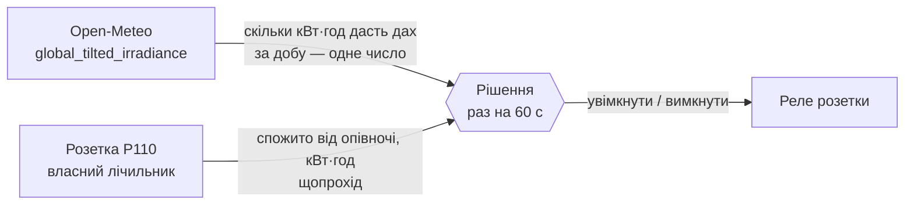
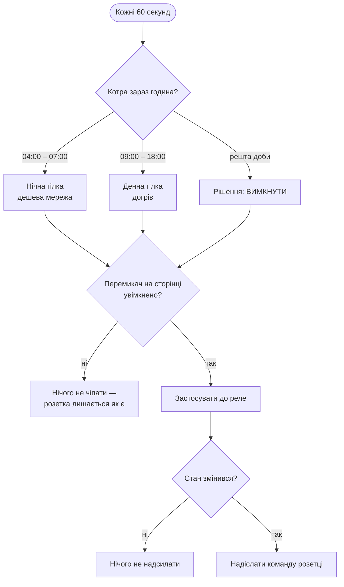
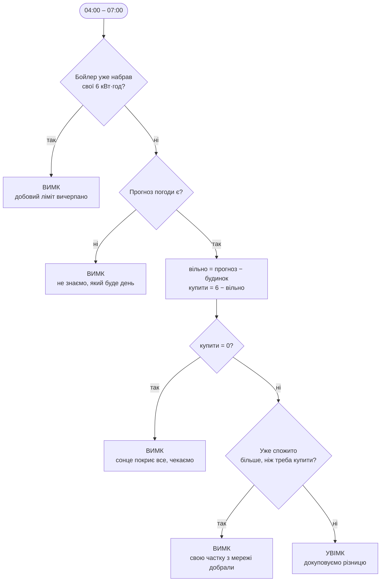
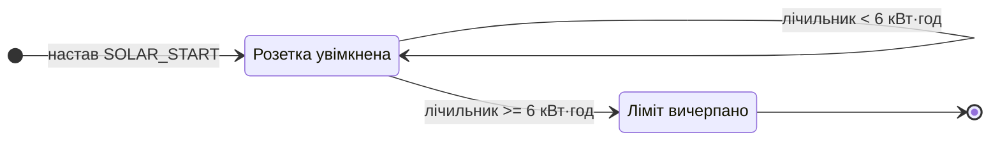
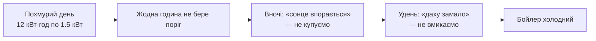
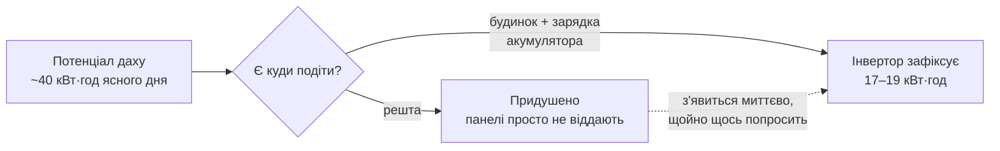
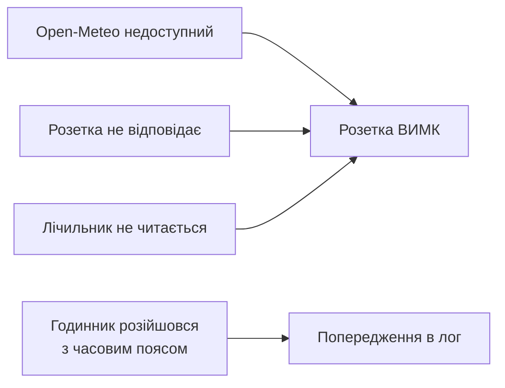

# Як працює алгоритм

Бойлеру треба **6 кВт·год на добу**. Програма щоночі рахує, скільки з них
завтра дасть сонце безкоштовно, і докуповує з мережі **тільки різницю**.
Решту дня вона просто догріває бойлер тим, що є.

Керується **одна розетка** — `PLUG_B_IP`. Більше нічого програма не чіпає.

---

## 1. Звідки беруться числа

Два джерела — і більше жодного. Інвертор не опитується взагалі.



Прогноз рахується під **вашу геометрію панелей** — 10 кВт, нахил 20°,
азимут 240°. Open-Meteo одразу віддає освітленість у площині панелі, тому
ніякої тригонометрії в коді немає.

Лічильник розетки обнуляється опівночі. Обидва вікна читають саме його, тож
**добовий ліміт спільний**: що купила ніч, того вдень уже не добиратимуть.

---

## 2. Уся арифметика

Одне число з прогнозу — скільки дах зробить **за цілий день** — і одне з
лічильника. Оце й усе:

```
вільно      = обмежити(прогноз кВт·год за добу − HOUSE_DAYTIME_KWH,  0 … 6)

купити вночі = 6 − вільно
```

`HOUSE_DAYTIME_KWH` — це те, що з даху забирає **решта будинку** за вікно
`SOLAR_START`–`SOLAR_END`, разом із зарядкою акумулятора від сонця: це теж
дах, якого бойлер не побачить. Єдине число тут, яке доводиться оцінювати;
решта або виміряна, або спрогнозована.

---

## 3. Загальний цикл



Якщо стан не змінився — команда не надсилається взагалі. Тиха ніч це один
`OFF` на старті й більше нічого.

### Пауза зі сторінки

Перемикач у правому верхньому куті панелі (`switching` / `paused`) вирішує,
чи взагалі вільно програмі керувати реле. На паузі вона **продовжує** читати
лічильник, тягнути прогноз, рахувати рішення й писати кожен прохід у журнал —
але не надсилає розетці нічого, тож та лишається рівно в тому стані, в якому
була. Сама пауза нічого не вмикає й не вимикає.

Перемикач лежить у журналі (`data/history.db`), а не в пам'яті, тож
переживає перезапуск контейнера. Повернення в `switching` наново надсилає
поточне рішення розетці — за час паузи її могли перемкнути руками з застосунку
Tapo.

---

## 4. Нічна гілка (04:00 – 07:00)



Розетка вимикається **посеред вікна**, щойно лічильник показав потрібну
частку. Не «всі 6 або нічого».

> **Обережно.** Прогноз перечитується щогодини, а рішення перераховується
> щохвилини. Якщо Open-Meteo серед ночі погіршить прогноз, ціль зросте
> прямо під увімкненою розеткою — і за ніч буде куплено більше, ніж
> показувала цифра о 04:00.

---

## 5. Денна гілка (від 09:00)

Найпростіша частина: **ніякого прогнозу і ніяких порогів.**



Від `SOLAR_START` розетка просто працює, доки лічильник не покаже
`DEVICE_DAILY_KWH`. Що дає дах — іде в бойлер першим, решту добирає мережа.

Оскільки лічильник спільний, нічна покупка зараховується сюди ж: якщо вночі
куплено 2 з 6 кВт·год, удень лишається добрати 4.

> **Лічильник — єдине гальмо цього вікна.** Якщо його не вдається прочитати,
> розетка тримається **вимкненою**, а не гріє наосліп. Раніше тут була ще
> й думка прогнозу — тепер немає.

---

## 6. Чому добовий підсумок, а не погодинна крива

Погодинний варіант тут був, і він був гіршим. Він угадував, які саме години
будуть достатньо сонячними, щоб потягнути бойлер **самотужки**, вмикався
лише в них, і з того ж рахунку визначав нічну покупку.



Добовий підсумок так помилитися не може. Він теж буває неточним — якщо день
вийде гіршим за прогноз, денне вікно добере різницю з мережі за денним
тарифом. Але ціна помилки тепер **трохи більший рахунок, а не холодний
бойлер**. Саме так і треба.

---

## 7. Коли ніч закоротка

Нічне вікно може віддати не більше ніж `години × DEVICE_POWER_KW`.

```
04:00–07:00 = 3 год × 2.0 кВт = 6.0 кВт·год
```

Рівно добовий ліміт, тобто **без жодного запасу**. Якщо ліміт підняти, різницю
вже фізично не купити за дешевим тарифом. Програма пише про це `warn` на
старті; денне вікно потім мовчки добере решту за денним тарифом.

---

## 8. Прогноз — це потенціал, а не те, що покаже інвертор



Система працює **без віддачі в мережу**. Тому щойно будинок і акумулятор
насичені, інвертор придушує панелі. За 13 днів: модель порахувала
416 кВт·год, інвертор записав 202.

Для нашого рішення правильне саме **потенційне** число: придушена енергія
з'явиться тієї ж миті, коли бойлер попросить. Але звідси випливає пастка:

> **Не можна калібрувати `PV_PERFORMANCE_RATIO` за добовим виробітком.**
> Вийде ≈ 0.39, і програма вирішить, що сонця не буде ніколи — тобто
> купуватиме мережу щоночі цілий рік.

Перевіряти модель треба на днях, коли система **не встигала** покрити власне
споживання. Програма інвертор не читає, тож це ручна звірка з його власним
застосунком, час від часу.

---

## 9. Якщо щось невідомо — вимикаємо



Гірший випадок — «заплатили денний тариф», а не «всю ніч гріли даремно».

---

## Далі

- [Сценарії](scenarios.md) — що станеться конкретного дня
- [Налаштування](../.env.example) — усі параметри з поясненнями
- [Запуск у Docker](../DOCKER.md)
