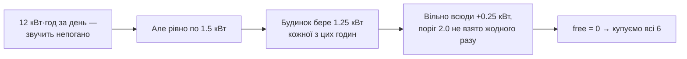
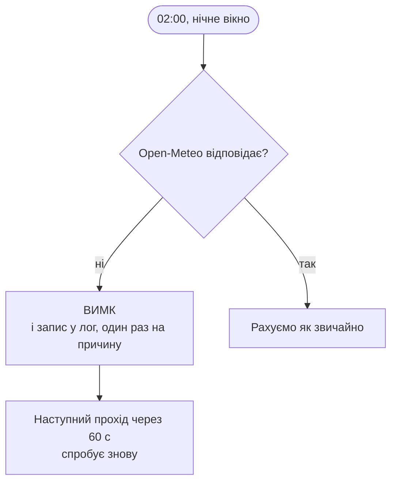
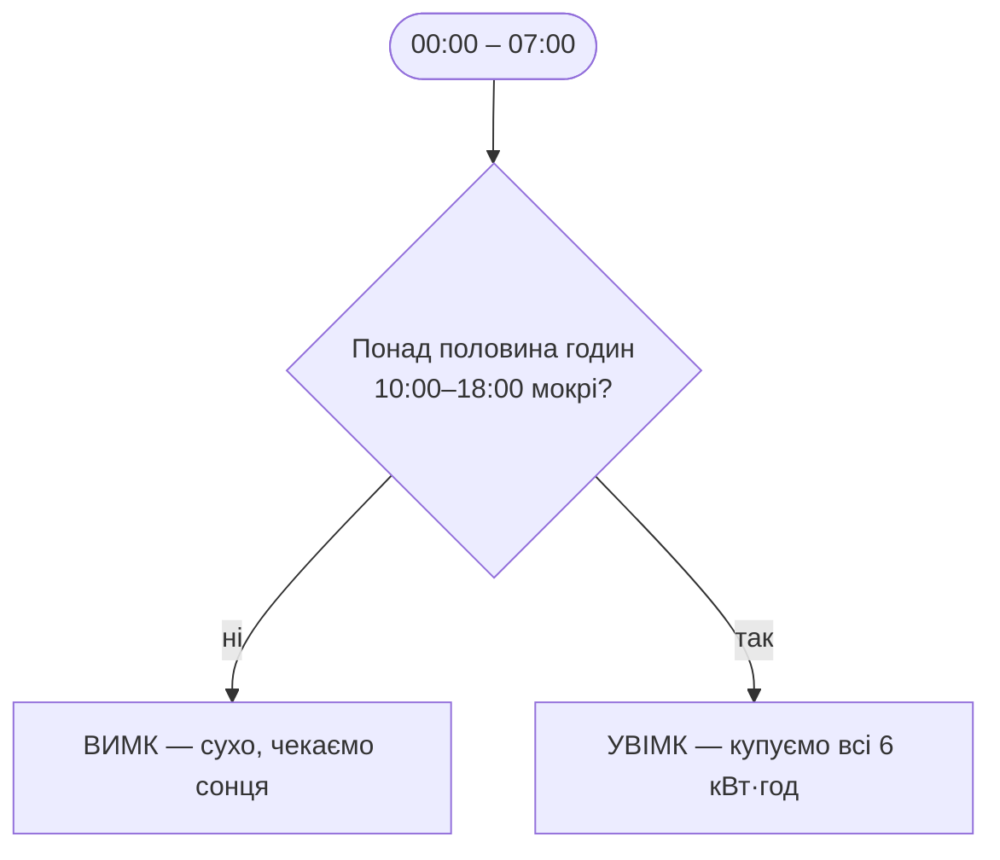

# Сценарії

Реальні числа для вашої системи: бойлер 6 кВт·год/добу і 2 кВт споживання,
будинок 10 кВт·год за вікно 10:00–18:00, масив 10 кВт.

Звідси базова лінія будинку:

```
HOUSE_BASELINE_KW = 10.0 / 8 год = 1.25 кВт
```

Тобто година вмикає бойлер, лише якщо прогноз на неї **≥ 3.25 кВт**
(1.25 будинку + 2.0 порога `SOLAR_SURPLUS_ON_KW`).

## Коротко

| Прогноз на 10:00–18:00 | Найкраща година | Безкоштовно бойлеру | Купити вночі |
|---|---|---|---|
| 9.3 кВт·год, пік 1.6 кВт — сьогодні | +0.35 кВт вільних | 0.0 | **6.0 кВт·год** (усе) |
| 12 кВт·год рівно по 1.5 кВт | +0.25 кВт | 0.0 | **6.0 кВт·год** (усе) |
| 12 кВт·год гострою дугою, пік 4.0 кВт | +2.75 кВт | 4.0 | **2.0 кВт·год** |
| 20 кВт·год, пік 5.0 кВт | +3.75 кВт | 6.0 | **нічого** |
| 38 кВт·год, ясно, пік 6.4 кВт | +5.15 кВт | 6.0 | **нічого** |

Два середні рядки — це той самий добовий підсумок, 12 кВт·год, із протилежними
відповідями. Саме тому рахунок іде по годинах.

---

## Сценарій 1. Сьогоднішній день — 9.3 кВт·год, і жодного вільного кіловата

Суцільна хмара, 100% весь день. `check.py` показує погодинно:

```
    11:00  ->  0.72 кВт   вільно -0.53
    12:00  ->  1.05 кВт   вільно -0.20
    13:00  ->  1.21 кВт   вільно -0.04
    14:00  ->  1.28 кВт   вільно +0.03
    15:00  ->  1.17 кВт   вільно -0.08
    16:00  ->  1.60 кВт   вільно +0.35
    17:00  ->  1.50 кВт   вільно +0.25
    18:00  ->  0.77 кВт   вільно -0.48
```

Дах за день зробить 9.3 кВт·год — але **жодна година не дотягує навіть до
2 кВт вільних**, не кажучи про 3.25. Майже весь виробіток іде на сам будинок,
місцями навіть не покриваючи його. Бойлеру не дістається нічого:

```
free = 0.0  →  купити = 6 − 0 = 6.0 кВт·год
```



```mermaid
gantt
    title 13 вересня, суцільна хмара
    dateFormat HH:mm
    axisFormat %H:%M
    todayMarker off
    section Розетка
    Докуповуємо всі 6.0 кВт·год :active, a1, 00:00, 03:00
    Ліміт вичерпано :done, a2, 03:00, 23:59
    section Вікна
    Дешева мережа :crit, n1, 00:00, 07:00
    Сонце (сьогодні марно) :s1, 10:00, 18:00
```

> Стара версія на цьому дні могла помилитися. Вона рахувала
> `9.3 − 10 + заряд`: при акумуляторі на 70% виходило +7.3 «безкоштовних»
> кВт·год, ніч не купувала нічого — а вдень масив так і не перекрив будинок,
> і бойлер лишався холодним. Заряд у батареї це не сонце; ним гріти бойлер
> означає просто розрядити її до вечора.

---

## Сценарій 2. Ясний день — 38 кВт·год

Дуга з піком 6.4 кВт. Вільно по годинах: 2.35, 3.75, 4.85, 5.15, 4.85, 3.75,
2.35, 0.65 кВт — сім годин із восьми перекривають поріг.

```
free = min(2.0, вільно) × 7 годин = 14.0  →  обмежено 6.0
купити = 6 − 6 = 0
```



```mermaid
gantt
    title Ясний день
    dateFormat HH:mm
    axisFormat %H:%M
    todayMarker off
    section Розетка
    Мережу не чіпаємо :done, a1, 00:00, 10:00
    Гріємо на чистому сонці :active, a2, 10:00, 13:00
    Набрано 6 кВт·год :done, a3, 13:00, 23:59
    section Вікна
    Дешева мережа :crit, n1, 00:00, 07:00
    Сонце :s1, 10:00, 18:00
```

О 10:00 вільно вже 2.35 кВт — розетка вмикається одразу і набирає свої
6 кВт·год за три години. Решту дня надлишок просто нікому не потрібен.

---

## Сценарій 3. Гостра дуга на 12 кВт·год — часткова докупка

Ранок і вечір затягнуті, але в середині дня хмара розходиться: 0.2, 0.5, 1.2,
3.3, 4.0, 1.8, 0.7, 0.3 кВт. Вільно: −1.05, −0.75, −0.05, **+2.05**, **+2.75**,
+0.55, −0.55, −0.95.

Поріг перетинають дві години:

```
free = min(2.0, 2.05) + min(2.0, 2.75) = 4.0
купити = 6 − 4 = 2.0 кВт·год
```



```mermaid
gantt
    title Гостра дуга, 12 кВт·год
    dateFormat HH:mm
    axisFormat %H:%M
    todayMarker off
    section Розетка
    Докуповуємо 2.0 кВт·год :active, a1, 00:00, 01:00
    Свою частку добрали :done, a2, 01:00, 13:00
    Решту дає сонце :active, a3, 13:00, 15:00
    Набрано 6 кВт·год :done, a4, 15:00, 23:59
    section Вікна
    Дешева мережа :crit, n1, 00:00, 07:00
    Сонце :s1, 10:00, 18:00
```

Це і є суть алгоритму: **мережа докриває тільки різницю**, решту дає сонце —
і ніч наперед знає, які саме дві години вдень спрацюють.

---

## Сценарій 4. Ті самі 12 кВт·год, розмазані рівно

Той самий добовий підсумок, що й у сценарії 3, але без піку: рівні 1.5 кВт
вісім годин поспіль. Вільно скрізь +0.25 кВт.



Добовий підсумок у сценаріях 3 і 4 однаковий, а відповіді протилежні: 2.0 проти
6.0 кВт·год з мережі. Формула з одним денним числом (`прогноз − будинок`) дала б
обом однакові 2 кВт·год — і в сценарії 4 бойлер лишився б недогрітим на 4.

---

## Сценарій 5. Немає зв'язку



Джерел лишилося два — прогноз і сама розетка — тож і відмовити може менше.
Жодна відмова не зупиняє програму: наступний прохід пробує заново, а помилка
пишеться в лог один раз на причину, а не щохвилини.

Вдень окремо: якщо для поточної години в прогнозі немає рядка, денна гілка теж
вимикає розетку, а не вгадує надлишок.

---

## Сценарій 6. Стратегія `rain` замість `forecast`

Якщо поставити `BOOST_STRATEGY=rain`, нічна гілка перестає рахувати кіловати:



Різниця принципова: `rain` не знає, **скільки** енергії буде. Сьогоднішній день —
100% хмарності, 0.0 мм дощу, тобто за цією стратегією «сухо, чекаємо сонця» —
і бойлер лишився б холодним при 9.3 кВт·год, з яких йому не дістається нічого.
Тому типово стоїть `forecast`.

---

## Перевірити на своїх числах

```bash
python check.py
```

Покаже погодинний прогноз із колонкою «вільно», позначить години, що беруть
поріг, і виведе рішення з усіма доданками — включно з тим, скільки кіловат
програма збирається купити цієї ночі.
