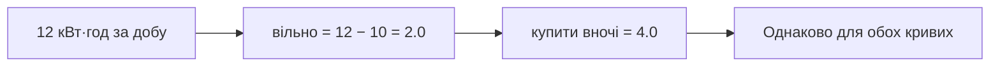
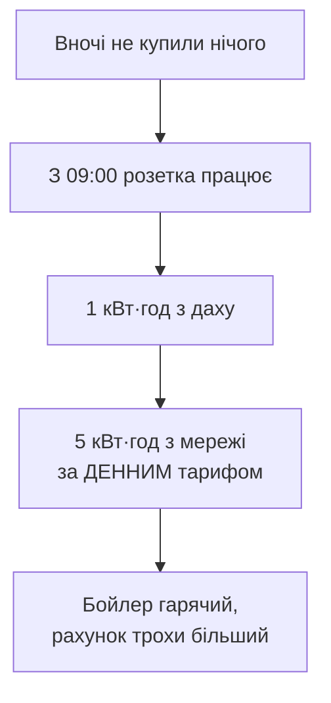
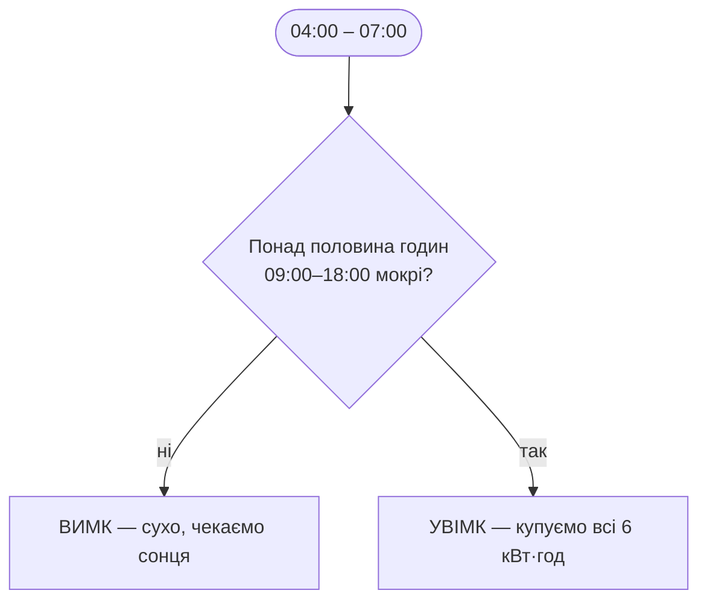

# Сценарії

Реальні числа для вашої системи: бойлер 6 кВт·год/добу і 2 кВт споживання,
будинок 10 кВт·год за світловий день, масив 10 кВт. Дешеве вікно 04:00–07:00,
догрів від 09:00.

Уся арифметика:

```
вільно       = обмежити(прогноз за добу − 10,  0 … 6)
купити вночі = 6 − вільно
```

## Коротко

| Прогноз на добу | Вільно бойлеру | Купити вночі | Добрати вдень |
|---|---|---|---|
| 19.7 кВт·год — сьогодні | 6.0 | **нічого** | 6.0 |
| 38 кВт·год, ясно | 6.0 | **нічого** | 6.0 |
| 13 кВт·год | 3.0 | **3.0 кВт·год** | 3.0 |
| 12 кВт·год — байдуже, якої форми | 2.0 | **4.0 кВт·год** | 2.0 |
| 9.3 кВт·год, суцільна хмара | 0.0 | **6.0 кВт·год** | 0.0 |

Форма кривої більше не впливає ні на що. Раніше впливала — і саме тому
бойлер лишався холодним.

---

## Сценарій 1. Сьогоднішній день — 19.7 кВт·год

`check.py` о 13:17:

```
  expected   : 19.7 kWh, peak 4.2 kW
  house first: 10.0 kWh of that before the load sees any
  free today : 6.0 kWh of the day's 19.7 kWh is left for the load
  load needs : 6.0 kWh -> buy 0.0 kWh from the grid tonight
```

19.7 − 10 = 9.7, а бойлеру треба лише 6 — отже вночі **не купуємо нічого**,
а з 09:00 розетка просто працює, доки лічильник не покаже 6 кВт·год.

```mermaid
gantt
    title 14 вересня, 19.7 кВт·год
    dateFormat HH:mm
    axisFormat %H:%M
    todayMarker off
    section Розетка
    Мережу не чіпаємо :done, a1, 00:00, 09:00
    Догрів, переважно від даху :active, a2, 09:00, 12:00
    Набрано 6 кВт·год :done, a3, 12:00, 23:59
    section Вікна
    Дешева мережа :crit, n1, 04:00, 07:00
    Догрів :s1, 09:00, 18:00
```



Зверніть увагу: о 09:00 дах ще дає близько 1.3 кВт, і будинок забирає своє.
Перші хвилини бойлер гріється частково з мережі — за денним тарифом. Це і є
свідомий компроміс нової логіки.

---

## Сценарій 2. Суцільна хмара — 9.3 кВт·год

```
вільно = обмежити(9.3 − 10, 0 … 6) = 0.0
купити = 6 − 0 = 6.0 кВт·год
```

Дах не покриває навіть будинок. Бойлеру не дістається нічого, і всі 6 кВт·год
беруться вночі за дешевим тарифом.

```mermaid
gantt
    title Похмурий день
    dateFormat HH:mm
    axisFormat %H:%M
    todayMarker off
    section Розетка
    Докуповуємо всі 6.0 кВт·год :active, a1, 04:00, 07:00
    Ліміт вичерпано :done, a2, 07:00, 23:59
    section Вікна
    Дешева мережа :crit, n1, 04:00, 07:00
    Догрів (не знадобився) :s1, 09:00, 18:00
```



**Тут вікно спрацьовує впритул.** 04:00–07:00 — це 3 години, при 2 кВт це
рівно 6.0 кВт·год. Запасу нема жодного: якщо розетка на хвилину відпаде або
бойлер бере менше за 2 кВт, залишок добереться вдень за денним тарифом.

---

## Сценарій 3. Середній день — 13 кВт·год

```
вільно = 13 − 10 = 3.0
купити = 6 − 3 = 3.0 кВт·год
```

Половина з мережі вночі, половина від даху вдень.

```mermaid
gantt
    title 13 кВт·год
    dateFormat HH:mm
    axisFormat %H:%M
    todayMarker off
    section Розетка
    Купуємо 3.0 кВт·год :active, a1, 04:00, 05:30
    Свою частку добрали :done, a2, 05:30, 09:00
    Догрів від даху :active, a3, 09:00, 10:30
    Набрано 6 кВт·год :done, a4, 10:30, 23:59
    section Вікна
    Дешева мережа :crit, n1, 04:00, 07:00
    Догрів :s1, 09:00, 18:00
```



Розетка вимикається о 05:30 — **посеред нічного вікна**, щойно лічильник
показав 3.0. Не «всі 6 або нічого».

---

## Сценарій 4. 12 кВт·год — і форма вже не має значення

Той самий добовий підсумок, дві протилежні криві:

- **рівно**: 1.33 кВт вісім годин поспіль
- **гострою дугою**: 0.2, 0.5, 1.2, 3.3, 4.0, 1.8, 0.7, 0.3 кВт



Обидва дні: купити 4.0, добрати 2.0 вдень.

> **Як було раніше.** Погодинна версія давала цим двом дням **різні**
> відповіді: рівному — купити всі 6 (жодна година не брала поріг), гострому —
> купити 2. І в рівному випадку вона ще й відмовлялася вмикати розетку вдень,
> бо жодна година «не була достатньо сонячною». Бойлер лишався холодним при
> 12 кВт·год на даху.

---

## Сценарій 5. День вийшов гіршим за прогноз

Нова ціна помилки — і її варто розуміти.

```
прогноз: 16 кВт·год  ->  вільно 6.0  ->  купити вночі 0
насправді: 11 кВт·год  ->  будинок забрав 10, бойлеру лишилась 1
```



Бойлер усе одно набирає свої 6 кВт·год — просто дорожче. Стара логіка в цій
самій ситуації лишала його холодним. Переплата виправляється наступної ночі;
холодний бойлер — ні.

---

## Сценарій 6. Немає зв'язку


Вдень окремо: якщо **лічильник розетки** не читається, денна гілка теж
вимикає розетку. Лічильник тепер єдине, що зупиняє це вікно, — без нього
бойлер грівся б до самого заходу сонця.

---

## Сценарій 7. Стратегія `rain` замість `forecast`

Якщо поставити `BOOST_STRATEGY=rain`, нічна гілка перестає рахувати кіловати:



`rain` не знає, **скільки** буде енергії. Похмурий день без дощу — 100%
хмарності, 0.0 мм — за цією стратегією «сухо», і всі 6 кВт·год доведеться
добирати вдень за денним тарифом. Тому типово стоїть `forecast`.

---

## Перевірити на своїх числах

```bash
python check.py
```

Покаже погодинний прогноз, показник лічильника і рішення з усіма доданками —
включно з тим, скільки програма збирається купити цієї ночі.
